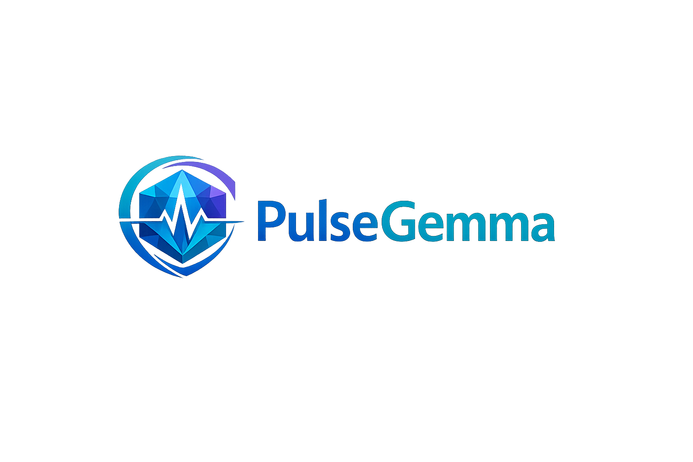

<p align="left">
  
</p>

# PulseGemma

### Edge AI Clinical Decision Support Engine
**Powered by Local Gemma 4 (NLU & Reasoning) and MedGemma 1.5 (Medical Vision)**

> Real-time patient history synthesis, 0ms deterministic safety rules, local medical image interpretation, hands-free voice dictation, and multilingual clinical translation—running 100% offline on the edge.

[](https://github.com/burgerman/PulseGemma.git)
[](#-local-model-architecture--ollama-setup)
[-emerald)](#-local-model-architecture--ollama-setup)
[](#-6-node-agentic-dag-workflow)

---

## ⚡ Overview

Emergency Departments face severe overcrowding, documentation overhead, and language barriers. Manual chart lookups and delayed triage processing increase the risk of adverse outcomes for critically ill patients. Generic AI models cannot be relied upon for medical mathematics or ungrounded diagnostic claims.

**PulseGemma** solves these challenges on the edge using a specialized dual-model architecture:

- **`Gemma 4 12B MTP` (`4skl/gemma4-12b-mtp`)**: Accelerated multi-token prediction model for multilingual voice dictation NLU, symptom entity extraction, clinical practice guideline RAG, and master triage brief synthesis.
- **`MedGemma 1.5` (`hf.co/unsloth/medgemma-1.5-4b-it-GGUF:Q8_0`)**: Interprets medical imagery including chest X-rays, 12-lead ECG strips, and paper lab printouts.
- **0ms Deterministic Safety Engine**: Evaluates panic lab limits and the ESI v4 decision tree in pure client code with zero model guesswork.

---

## 🛡️ Local Model Architecture & Ollama Setup

PulseGemma runs fully offline via local Ollama endpoints (`http://localhost:11434`):

```bash
# 1. Start the local Ollama background engine
ollama serve

# 2. Pull & Run Accelerated Gemma 4 12B MTP for Speech NLU, Translation & Synthesis
ollama pull 4skl/gemma4-12b-mtp:latest

# 3. Pull & Run MedGemma 1.5 for Medical Vision & OCR
ollama pull hf.co/unsloth/medgemma-1.5-4b-it-GGUF:Q8_0
```

### Deployment Options:
- 🛡️ **Pure Local Edge Mode (Default)**: Fully offline inference via Ollama.
- ☁️ **Hybrid Cloud VLM Mode**: Optional Cloud VLM API integration (`gemini-robotics-er-2-preview`) configured via `.env`.

---

## 🏛️ 6-Node Agentic DAG Workflow

```
                  ┌─────────────────────────────────────────────────┐
                  │                 PATIENT INPUTS                  │
                  │ (Voice Audio / Vitals / Labs / X-Rays / ECGs)   │
                  └────────────────────────┬────────────────────────┘
                                           │
                                           ▼
 ┌────────────────────────────────────────────────────────────────────────┐
 │ 1. Gemma 4 12B Multilingual Speech NLU & Symptom Extraction Node       │
 │    • Speech-to-text in 20+ languages -> Doctor summary & clinical concepts│
 └──────────────────────────────────┬─────────────────────────────────────┘
                                    │
                                    ▼
 ┌────────────────────────────────────────────────────────────────────────┐
 │ 2. 0ms Deterministic Safety & Rule Engine Node                         │
 │    • Panic lab thresholds & ESI v4 decision tree (Levels 1 - 5).       │
 └──────────────────────────────────┬─────────────────────────────────────┘
                                    │
                                    ▼
 ┌────────────────────────────────────────────────────────────────────────┐
 │ 3. MedGemma 1.5 / Vision Image Analysis Specialist Node                │
 │    • Parses X-Rays, 12-lead ECG strips, & paper lab sheet photos.      │
 └──────────────────────────────────┬─────────────────────────────────────┘
                                    │
                                    ▼
 ┌────────────────────────────────────────────────────────────────────────┐
 │ 4. Ground-Truth Guideline RAG Retrieval Node                           │
 │    • Fetches verbatim CPG passages (AHA 2023 ACS, Surviving Sepsis 2021)│
 └──────────────────────────────────┬─────────────────────────────────────┘
                                    │
                                    ▼
 ┌────────────────────────────────────────────────────────────────────────┐
 │ 5. Local Gemma 4 Multimodal Clinical Synthesizer Node                  │
 │    • Combines VLM visual findings + clinical notes + RAG guidelines.   │
 └──────────────────────────────────┬─────────────────────────────────────┘
                                    │
                                    ▼
 ┌────────────────────────────────────────────────────────────────────────┐
 │ 6. Grounding Safety Audit & EHR Export Node                            │
 │    • Verifies guideline citations & exports clean triage brief.        │
 └────────────────────────────────────────────────────────────────────────┘
```

---

## 🖥️ Interface & Clinical Dashboard Layout

PulseGemma uses a clean 2-column clinical dashboard layout:

- **Left Sidebar**: Patient demographic profile, calculated ESI level badge, vital signs grid, and emergency case scenario switcher.
- **Main Workspace**: Top tab bar navigation providing instant access to:
  1. 📋 **Master Triage Brief**: 5-second intake snapshot, differential diagnostics with guideline evidence links, and EHR copy.
  2. 🎙️ **Voice Dictation**: Hands-free oral symptom capture with Gemma 4 doctor summary.
  3. 📸 **Medical Vision**: Upload and analyze chest X-rays, ECGs, and lab prints with MedGemma 1.5.
  4. 🧪 **Lab Rules**: Instant deterministic biomarker range checker & risk scores.
  5. 📚 **Guidelines RAG**: Verbatim clinical practice guideline passages.

---

## 🚀 Emergency Test Scenarios

PulseGemma includes 4 pre-configured clinical test cases:

1. 🫀 **ACS Chest Pain (STEMI / Spanish)**: Spoken Spanish transcript, Cardiac Troponin I = `0.85 ng/mL` (PANIC), 12-lead ECG STEMI scan, ESI Level 2.
2. 🔥 **Severe Septic Shock (Chinese)**: Spoken Chinese transcript, BP `88/54`, Lactate = `4.2 mmol/L`, qSOFA = 3, Chest X-Ray lobar pneumonia scan, ESI Level 1.
3. ⚡ **Acute ESRD Hyperkalemia (French)**: Spoken French transcript, Serum Potassium K+ = `6.8 mEq/L` (PANIC), paper lab report photo, ESI Level 2.
4. 🩸 **Diabetic Ketoacidosis (DKA / English)**: English transcript, Blood Glucose = `380 mg/dL`, pH `7.22`, HCO3 `12 mEq/L`, ESI Level 2.

---

## 🛠️ Quick Start

```bash
# 1. Clone the repository
git clone https://github.com/burgerman/PulseGemma.git
cd PulseGemma

# 2. Install dependencies
npm install

# 3. Start local Ollama background engine (required for local model calls)
ollama serve

# 4. Pull required local models
ollama pull 4skl/gemma4-12b-mtp:latest
ollama pull hf.co/unsloth/medgemma-1.5-4b-it-GGUF:Q8_0

# 5. Launch development server
npm run dev
```

---

## 📜 Disclaimer

*PulseGemma is an experimental AI tool designed strictly for research, hackathon demonstration, and clinical decision support prototyping. It does not replace professional medical judgment, diagnosis, or treatment.*

